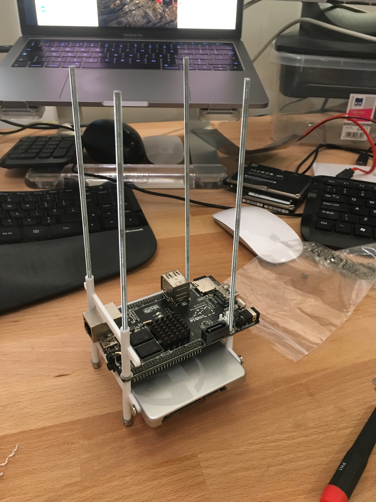
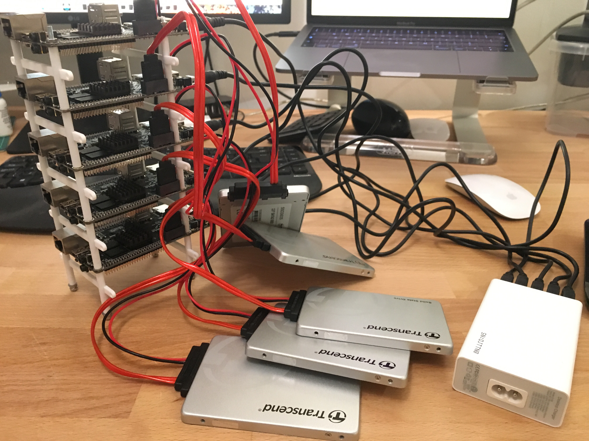
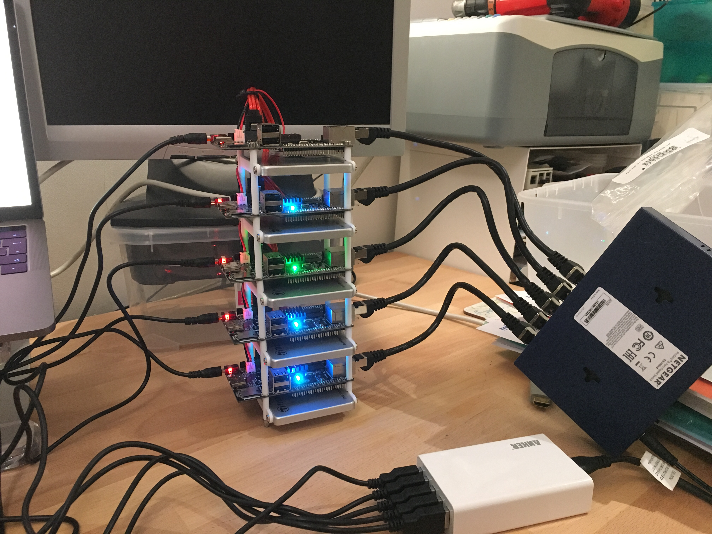
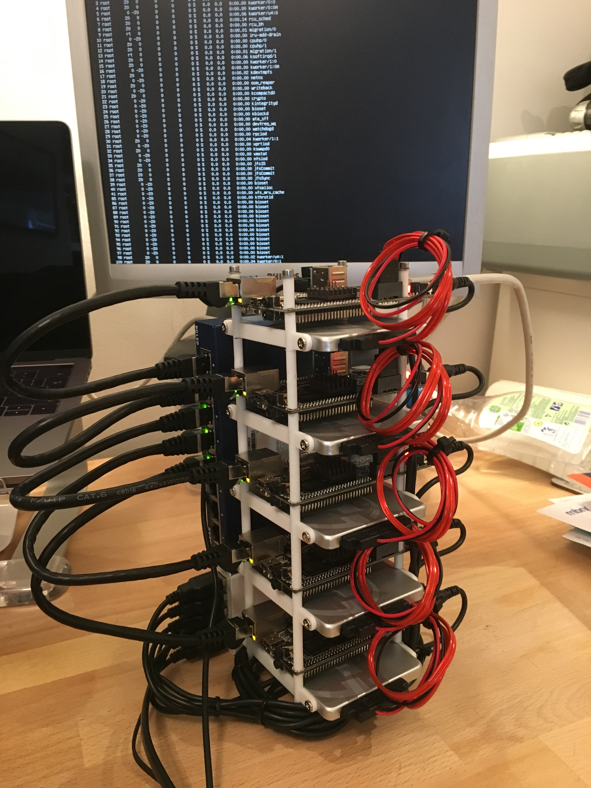

# Cubienetes: A Kubernetes Cluster on Cubieboard2s

This is a project to build a home 5-node Kubernetes cluster using Cubieboards.

## Parts

- 5 x [Cubieboard2](https://www.amazon.co.uk/dp/B00FB5ILQ4) £48.95
- 1 x [NETGEAR GS108UK 8-Port Gigabit Ethernet Unmanaged Switch](https://www.amazon.co.uk/gp/product/B0000E5SES) £24.97
- 1 x [Anker 40W 5-Port USB Charger](https://www.amazon.co.uk/dp/B00EJA28ES)
- 5 x [Short Black 0.25M Ethernet Cable](https://www.amazon.co.uk/gp/product/B00E7B1K2A) £1.81
- 1 x [Kingston MobileLite G4 USB 3.0 Multi Card Reader](https://www.amazon.co.uk/gp/product/B00KX4TORI) £7.12
- 2 x [1000mm M3 threaded rod](https://www.amazon.co.uk/gp/product/B01F3RLO8Q) £2.54
- 2 x [M3 Full Nut (50 Pack)](https://www.amazon.co.uk/gp/product/B00A6G3G2C) £1.40
- 2 x [M3 Washer 3.2mm (50 Pack)](https://www.amazon.co.uk/gp/product/B00A6PGHC4) £1.65
- 10 x [Custom 3D-printed HD brackets](https://www.shapeways.com/product/WRM3XQTWM/hdbracket) £3.50
- 5 x [Transcend 128GB SATA III SSD360 128GB](https://www.amazon.co.uk/dp/B018HW0EA8) £56.50

## Assembly

First versions of the hard disk brackets didn't quite fit:



I did a full build to get a handle on the cabling too:



Problems were:
- The SSD mounting hole pitch was off by 0.5mm.
- The walls around the pillars meant the distance between the pillars was too small.
- The bore of all the holes (3mm) was too tight for M3 threaded rod and needed drilling out.  Surprisingly the Shapeways white plastic took this quite well.

So I created & new design and ordered that:



And with the router & PSU double-sided-sticky taped on, and cables all cable-tied:



## Software

### Operating System

- Used Debian Jessie from https://www.armbian.com/cubieboard-2/
- Use [Keka](http://www.kekaosx.com/en/) and [Etcher](https://etcher.io/) to decompress / write the image.
- Use the latest kernel you can - Docker needs it.

### SSH

For ansible to work, you need to setup password-less ssh:

```
mkdir .ssh
chmod 700 ~/.ssh
echo "<REDACTED>" > ~/.ssh/authorized_keys
chmod 600 ~/.ssh/authorized_keys
```

I did this manually.  I also statically assigned IP addresses 192.168.0.1-5 to the Cubieboards manually.  The rest was configured with ansible.

### Networking.

I designated the first Cubieboard as the "master", and set it up to do NAT routing & DNS as it also has a WiFi adapter.

```
ansible-playbook --inventory-file=inventory --user=root custom-playbooks/networking.yaml
```

### Disks

The disks got LVM & ext4 installed and mounted at /mnt/countainers:

```
ansible-playbook --inventory-file=inventory --user=root custom-playbooks/disks.yaml
```

### Docker Daemon

- Used [Hypriot's instructions](http://blog.hypriot.com/post/family_arm_hardware_for_docker_more_children/)
- https://packagecloud.io/app/Hypriot/Schatzkiste/search?filter=all&q=docker-hypriot&dist=debian%2Fjessie

```
$ curl https://packagecloud.io/gpg.key | sudo apt-key add -
$ sudo bash -c 'cat > /etc/apt/sources.list.d/Hypriot_Schatzkiste.list' << EOF
deb https://packagecloud.io/Hypriot/Schatzkiste/debian/ jessie main
EOF
```


